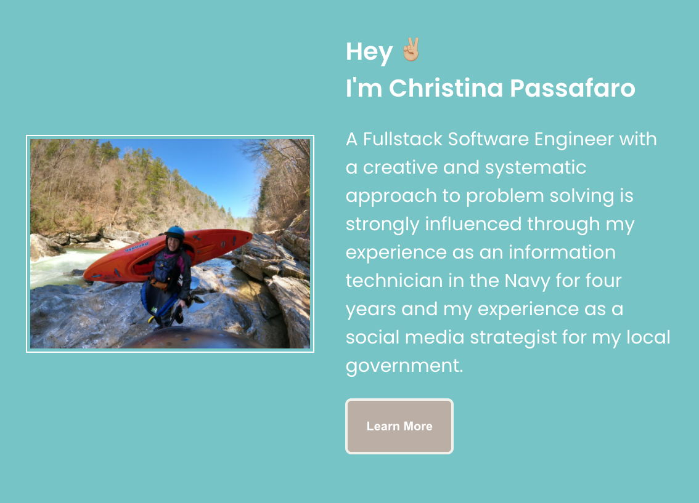

## Portfolio

### Project Description
This project was completed using React Framework. It displays projects that I have worked on to make it easy to access deployed pages and repos. It also allows easy access to my linkedin and github.

## Deployed URL
https://christinapassafaro.netlify.app/projects

## To Run
- Fork Repository
- npm install
- npm start

## Sample
****

### Development Process

__Date__ | __Progress__ | __To Do__|
------------|-------------|-----------|
12/2/2020 | Started creating react app, header, and welcome page. Only CSS done | Add functionality to Header and buttons|
12/3/2020 | About me done| Add Projects page|
12/4/2020 | Project page underway | continue styling |
12/5/2020 | Project styling and projects uploaded |continue styling but lowbar accomplished, add resume download link and contact info |
